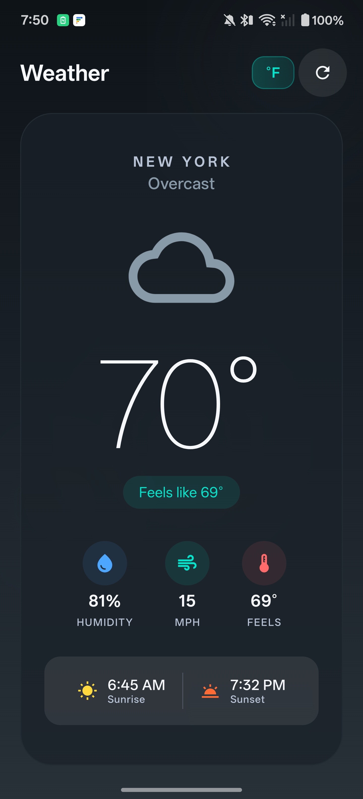

# Weather App

Android weather app built with Jetpack Compose and Kotlin.



## Features

- Current weather conditions
- Hourly and 7-day forecasts
- Celsius/Fahrenheit toggle
- Pull-to-refresh

## Tech Stack

- Jetpack Compose
- Hilt (DI)
- Retrofit + Kotlinx Serialization
- MVI architecture
- Open-Meteo API

## Building

```
./gradlew assembleDebug
```

## Requirements

- Android SDK 30+
- JDK 21
